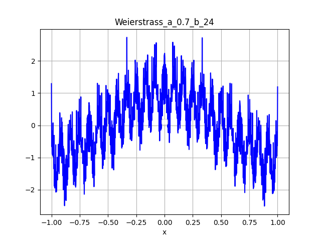

# Project fonctions continues nulle part dérivables

## Auteur

- Aurélien Pardo [Linkedin](www.linkedin.com/in/aurélien-pardo-24a02324b).

Ce dépôt explore les fonctions continues nulle part différentiables, une classe fascinante de fonctions qui sont continues partout mais sans dérivée en aucun point. Ces fonctions remettent en question les concepts traditionnels du calcul et sont des exemples de comportements « irréguliers » en analyse mathématique. Le projet inclut un script Python pour visualiser de telles fonctions, fournissant des informations sur leurs propriétés uniques et leur apparence. Ce projet a été réalisé dans le cadre d'un petit sujet de recherche en mathématique en Licence 2 sous la direction de Michel Raibaut.

## Contenus

- **Script Python**: Code pour générer et visualiser des exemples de fonctions continues nulle part différentiables reposant sur la fonction de Weierstrass.
- **Exemples de visualisations**: Plusieurs exemples en faisant varier les paramètres pour générer différents types de fonctions continues nulle part dérivables.

- **Fichier pdf**: Un document format pdf, explicitant et justifiant la démarche et les preuves d'existences de telles fonctions avec application du Lemme de Baire (preuve de la densité dans l'ensemble des fonctions continues).

## Prérequis

Ce projet nécessite Python et les bibliothèques suivantes :

- matplotlib (pour l'affichage graphique)
- numpy (pour les opérations numériques)

## Erratum

N'hesitez pas à signaler les erreurs possibles du projet.
